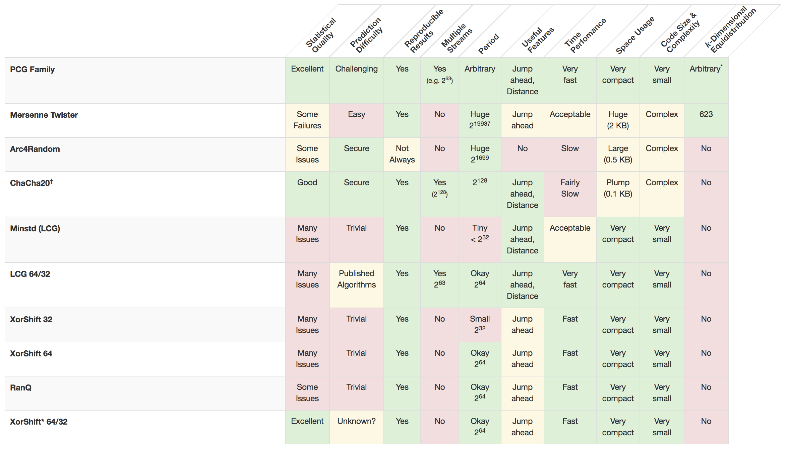

# rng.js

rng.js is a pseudo-random number generator implemented using the [PCG algorithm](http://www.pcg-random.org/).

The implementation was inspired by [PCG Random](https://github.com/thomcc/pcg-random) but extends the library with random access.

## rng.js Features

- Generates a 32-bit float [0,1)
- Seedable
- Random access
  - Retrieve the *nth* number of the RNG sequence in log(*n*) time
  - Jump ahead by *n* numbers in log(*n*) time
- 2 ^ 64 period
- Supports 64-bit seeds
- Supports 64-bit random access
- Save and Load states
- Excellent statistical quality

 *Source: http://www.pcg-random.org/*


## Documentation

### Random Number Generation

#### `Create New RNG`

```javascript
/**
 * Returns a new random number generator
 * @param {integer: negative numbers transformed to 32-bit unsigned} lowSeed 
 * @param {integer: negative numbers transformed to 32-bit unsigned} highSeed 
 */
var rng = new Random(lowSeed, highSeed);
```

- lowSeed : the lower (rightmost) 32-bits of the 64-bit seed. (defaults to `0xf02386`)
- highSeed : the higher (leftmost) 32-bits of the 64-bit seed. (defaults to `0xfa472`)

#### `Get random number`

```javascript
let rng = new Random(-23920393, 2332332);
let randomNumber = rng.nextNumber();
```

- Returns the next number in the RNG sequence.
- nextNumber() returns a 32-bit float [0,1)

#### `Jump ahead by n numbers`

```javascript
let rng = new Random();
/**
 * Get the next random number by skipping forward by n steps.
 * If no params: Behaves like nextNumber.
 * @param {integer: negative numbers transformed to 32-bit unsigned} lowSkip 
 * @param {integer: negative numbers transformed to 32-bit unsigned} highSkip
 * eg. rng.nthSkip(lowSkip, highSkip);
 */

//Jump ahead by a 32-bit number
let tenthNumber = rng.nthSkip(10);
let hundredthNumber = rng.nthSkip(90);
let thousandthNumber = rng.nthSkip(900);

//Jump ahead by a 64-bit number
let rng2 = new Random(); 
let bigNumber = rng2.nthSkip(23, 59); 
//Big number is the 253403070487th state of the RNG sequence
//or the 11101100000000000000000000000000010111th state in binary
```

- lowSkip : the lower (rightmost) 32-bits of the 64-bit skip. (defaults to `1`)
- highSkip : the higher (leftmost) 32-bits of the 64-bit skip. (defaults to `0`)


#### `Retrieve nth number in RNG sequence`

```javascript
let rng = new Random();
/**
 * Get the nth random number in the RNG sequence
 * If no params: Returns the zeroth number in the RNG sequence
 * @param {integer: negative numbers transformed to 32-bit unsigned} lowNumber
 * @param {integer: negative numbers transformed to 32-bit unsigned} highNumber 
 * eg. rng.nthNumber(lowNumber, highNumber)
 */

//Retrieve nth number where n is a 32-bit number
let tenthNumber = rng.nthNumber(10);
let hundredthNumber = rng.nthNumber(100);
let thousandthNumber = rng.nthNumber(1000);

//Jump ahead by a 64-bit number
let rng2 = new Random(); 
let bigNumber = rng2.nthSkip(23, 59); 
//Big number is the 253403070487th state of the RNG sequence
//or the 11101100000000000000000000000000010111th state in binary
```

- lowNumber : the lower (rightmost) 32-bits of the 64-bit number. (defaults to `0`)
- highNumber : the higher (leftmost) 32-bits of the 64-bit number. (defaults to `0`)

### Getters and setters

#### `Get/Set RNG seed`

```javascript
/**
 * Returns the seed of the RNG
 * [lowSeed, highSeed]
 */
rng.getSeed();

/**
 * Set the seed of the RNG, state and count is reset
 * @param {integer: negative numbers transformed to 32-bit unsigned} lowSeed
 * @param {integer: negative numbers transformed to 32-bit unsigned} highSeed
 */
rng.setSeed(lowSeed, highSeed);
```

- lowSeed : the lower (rightmost) 32-bits of the 64-bit seed. (defaults to `0xf02386`)
- highSeed : the higher (leftmost) 32-bits of the 64-bit seed. (defaults to `0xfa472`)

#### `Get/Set State Count`

```javascript
/**
 * Returns the state count of the RNG
 * [lowCount, highCount]
 */
rng.getSeed();

/**
 * Set the RNG to the nth state
 * If no params: Reset the RNG sequence to the zeroth state
 * @param {integer: negative numbers transformed to 32-bit unsigned} lowCount 
 * @param {integer: negative numbers transformed to 32-bit unsigned} highCount 
 */
rng.setStateCount(lowCount, highCount);
```

- lowCount : the lower (rightmost) 32-bits of the 64-bit count. (defaults to `0`)
- highCount : the higher (leftmost) 32-bits of the 64-bit count. (defaults to `0`)

#### `Get/Set Incrementer`

```javascript
/**
 * Returns the current incrementer used by the RNG
 * [lowCount, highCount]
 */
rng.getSeed();

/**
 * Set the RNG to the nth state
 * If no params: Reset the RNG sequence to the zeroth state
 * @param {integer: negative numbers transformed to 32-bit unsigned} lowConstant 
 * @param {integer: negative numbers transformed to 32-bit unsigned} highConstant 
 */
rng.setStateCount(lowConstant, highConstant);
```

- lowConstant: the lower (rightmost) 32-bits of the 64-bit incrementer. (defaults to `0`)
- highConstant : the higher (leftmost) 32-bits of the 64-bit incrementer. (defaults to `0`)


#### `Save/Load RNG state`

```javascript
/**
 * Save the full set of states that represent the RNG
 * [lowSeed, highSeed, lowStateCount, highStateCount, lowConstant, highConstant]
 */
var saveDate = rng.saveRngStates();

/**
 * Load a full set of states to the RNG
 * @param {integer: negative numbers transformed to 32-bit unsigned} lowSeed 
 * @param {integer: negative numbers transformed to 32-bit unsigned} highSeed 
 * @param {integer: negative numbers transformed to 32-bit unsigned} lowStateCount 
 * @param {integer: negative numbers transformed to 32-bit unsigned} highStateCount 
 * @param {integer: negative numbers transformed to 32-bit unsigned} lowConstant 
 * @param {integer: negative numbers transformed to 32-bit unsigned} highConstant 
 */
rng.loadRngStates(
  lowSeed, highSeed,
  lowStateCount, highStateCount,
  lowConstant, highConstant
)
```

